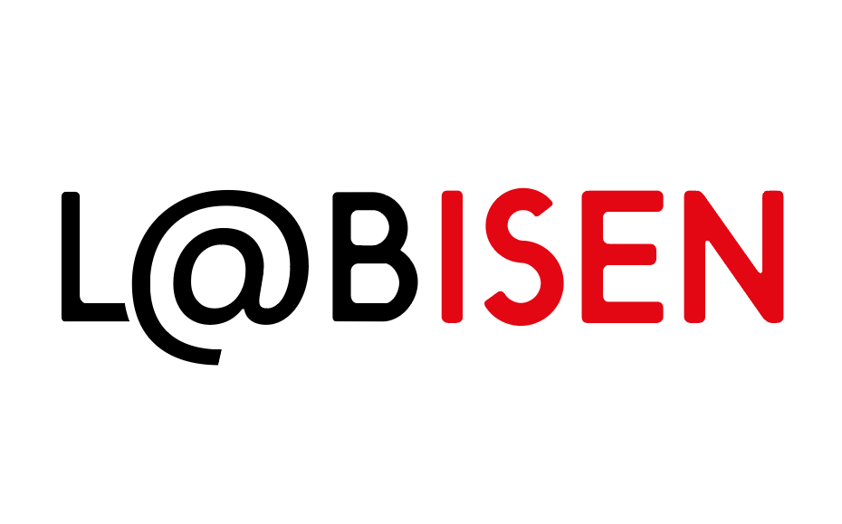

<div align="center">



# Spatio-Temporal Transformers for High-Accuracy Detection of Embryo Developmental Transitions

[](https://opensource.org/licenses/MIT)
[](https://www.python.org/downloads/)
[](https://pytorch.org/)

</div>

A comprehensive system for analyzing embryo developmental transitions using state-of-the-art deep learning models, featuring both training capabilities and a web-based application for real-time analysis.

## 🧬 Project Overview

This project provides a complete solution for embryo developmental transition detection, combining:

- **Training Pipeline**: Advanced deep learning models (ResNet18, TimeSformer) for embryo analysis
- **Web Application**: Flask-based interface for real-time embryo management and AI-powered predictions
- **Database Integration**: PostgreSQL backend for secure data management
- **File Management**: Organized storage system for embryo images and annotations

## 📁 Project Structure

```
Spatio-Temporal-Transformers-for-High-Accuracy-Detection-of-Embryo-Developmental-Transitions/
├── Training/                    # Deep learning training pipeline
│   ├── train.py                # Main training script
│   ├── DataSet.py              # Custom dataset implementation
│   ├── ModelBuilder.py         # Model architecture definitions
│   ├── config_args.py          # Configuration management
│   └── preProcess.py           # Data preprocessing utilities
├── WebApplication/             # Flask web application
│   ├── app.py                  # Main Flask application
│   ├── Classes/                # Business logic classes
│   ├── Routes/                 # API endpoints
│   ├── static/                 # Frontend assets (CSS, JS)
│   ├── templates/              # HTML templates
│   └── Dataset_shema.sql       # Database schema
├── Configs/                    # Configuration files
│   └── config.ini             # Training configuration
├── Data/                      # Dataset storage (extracted here)
├── Results/                   # Model checkpoints and results
├── requirements.txt           # Python dependencies
└── README.md                  # This file
```

## 🚀 Quick Start

### 1. Environment Setup

Create and activate a conda environment:

```bash
# Create conda environment with Python 3.10
conda create -n embryo_env python=3.10

# Activate environment
conda activate embryo_env

# Install dependencies
pip install -r requirements.txt
```

### 2. Database Setup

The project uses **PostgreSQL** as the database backend. Follow these steps to set up the database:

#### Install PostgreSQL

```bash
# Windows (using Chocolatey)
choco install postgresql

# macOS (using Homebrew)
brew install postgresql

# Ubuntu/Debian
sudo apt-get install postgresql postgresql-contrib
```

#### Create Database and Run Schema

```bash
# Connect to PostgreSQL as superuser
psql -U postgres

# Create database
CREATE DATABASE embryo_db;

# Create user (optional)
CREATE USER embryo_user WITH PASSWORD 'your_password';

# Grant privileges
GRANT ALL PRIVILEGES ON DATABASE embryo_db TO embryo_user;

# Exit psql
\q

# Run the database schema
psql -U postgres -d embryo_db -f WebApplication/Dataset_shema.sql
```

#### Environment Configuration

Create a `.env` file in the `WebApplication/` directory with your database credentials:

```bash
# Create .env file in WebApplication directory
cd WebApplication
touch .env
```

Add your database credentials to the `.env` file:

```env
# Database Configuration
host=localhost
database=embryo_db
user=embryo_user
password=your_password
port=5432

# Application Configuration
EMBRYO_IMAGES_PATH=C:/Embryo_images
SECRET_KEY=your-secret-key-here
```

**Important**: Replace the credentials with your actual PostgreSQL setup:

- `host`: Your PostgreSQL server host (usually `localhost`)
- `database`: Database name (use `embryo_db` or your preferred name)
- `user`: Your PostgreSQL username
- `password`: Your PostgreSQL password
- `port`: PostgreSQL port (default: `5432`)

### 3. Data Preparation

Extract the embryo dataset to the Data folder and run preprocessing:

```bash
# Extract dataset (replace with actual dataset path)
tar -xzf embryo_dataset.tar.gz -C Data/

# Run preprocessing
cd Training
python preProcess.py
```

### 4. Configuration

The system uses `Configs/config.ini` for training configuration:

```ini
[data]
data_loader = image_seq    # Data loader type (image_seq/video)
window_size = 8           # Sequence window size
stride = 1               # Sliding window stride

[model]
name = resnet18          # Model architecture (resnet18/timesformer)
pretrained = True        # Use pretrained weights

[training]
batch_size = 1           # Training batch size
epochs = 100             # Number of training epochs
learning_rate = 0.001    # Learning rate
num_workers = 8          # Data loading workers
image_size = 224         # Input image size
```

## 🎯 Training Pipeline

### Basic Training

Train a model with default configuration:

```bash
cd Training
python train.py
```

### Advanced Training with Custom Parameters

Override configuration parameters via command line:

```bash
# Train ResNet18 with custom parameters
python train.py --model_name resnet18 --batch_size 16 --epochs 50 --learning_rate 0.0001

# Train TimeSformer for 32-frame sequences
python train.py --model_name timesformer --window_size 32 --batch_size 8 --epochs 100

```

### Training Arguments Explained

| Argument          | Description            | Default  | Example               |
| ----------------- | ---------------------- | -------- | --------------------- |
| `--model_name`    | Model architecture     | resnet18 | resnet18, timesformer |
| `--batch_size`    | Training batch size    | 1        | 16, 32, 64            |
| `--epochs`        | Training epochs        | 100      | 50, 100, 200          |
| `--learning_rate` | Learning rate          | 0.001    | 0.0001, 0.001, 0.01   |
| `--window_size`   | Sequence window size   | 8        | 8, 16, 32             |
| `--stride`        | Sliding window stride  | 1        | 1, 2, 4               |
| `--num_workers`   | Data loading workers   | 8        | 4, 8, 16              |
| `--image_size`    | Input image size       | 224      | 224, 256, 512         |
| `--pretrained`    | Use pretrained weights | True     | True, False           |

### Model Selection

- **ResNet18**: Best for 8-frame sequences, faster training
- **TimeSformer**: Best for 32-frame sequences, higher accuracy

## 🌐 Web Application

### Starting the Web Application

1. **Configure Environment Variables**:
   The `.env` file should already be created during database setup. If not, create it:

   ```bash
   cd WebApplication
   touch .env
   ```

   Add your PostgreSQL credentials to the `.env` file:

   ```env
   # Database Configuration
   host=localhost
   database=embryo_db
   user=your_username
   password=your_password
   port=5432

   # Application Configuration
   EMBRYO_IMAGES_PATH=C:/Embryo_images
   SECRET_KEY=your-secret-key-here
   ```

2. **Run Flask Application**:

   ```bash
   cd WebApplication
   flask run
   ```

3. **Access Application**: Open browser to `http://127.0.0.1:5000`

### Web Application Features

#### 🔐 Authentication System

- **Admin Users**: Manage doctor accounts and system settings
- **Doctor Users**: Manage embryo records and run AI predictions
- **Session-based authentication** with secure cookies

#### 👨‍⚕️ Doctor Interface (`/Doctor/Embryo`)

- **Embryo Management**: Add, update, delete embryo records
- **Image Upload**: Drag-and-drop interface for embryo images
- **Frame Preview**: Thumbnail-based frame navigation
- **Phase Annotation**: Dropdown-based phase selection system
- **AI Prediction**: Real-time developmental transition prediction
- **CSV Export**: Automatic annotation file generation

#### 👨‍💼 Admin Interface (`/Admin/Doctor`)

- **Doctor Management**: CRUD operations for doctor accounts
- **Access Control**: Global access permission management
- **System Monitoring**: User activity and system status

#### 🤖 AI Prediction System

- **Model Selection**: Automatic selection based on frame count
  - 8 frames → ResNet18 model
  - 32 frames → TimeSformer model
- **Visual Indicators**: Color-coded prediction results
  - 🔵 Blue circle: No transition predicted
  - 🔴 Red circle: Transition predicted
- **Sliding Window**: Overlapping frame analysis
- **GPU Support**: Automatic CUDA detection and optimization

### API Endpoints

#### Doctor Endpoints (`/Doctor`)

- `GET /Embryo/LIST` - Retrieve embryo records
- `POST /Embryo/ADD` - Add new embryo with images
- `POST /Embryo/UPDATE` - Update embryo record
- `POST /Embryo/DELETE` - Delete embryo record
- `POST /Embryo/GET_IMAGES` - Get embryo images and annotations
- `GET /Embryo/IMAGE/<id>/<filename>` - Serve image files
- `POST /Embryo/PREDICT` - Run AI prediction

#### Admin Endpoints (`/Admin`)

- `GET /Doctor/LIST` - List all doctors
- `POST /Doctor/ADD` - Add new doctor
- `POST /Doctor/UPDATE` - Update doctor information
- `POST /Doctor/DELETE` - Delete doctor
- `POST /Doctor/UPDATE_ACCESS` - Update global access

## 📊 Dataset Information

The system works with embryo image sequences containing developmental transitions. The dataset includes:

- **Image Sequences**: Time-lapse embryo images
- **Annotations**: Phase labels for each frame
- **Metadata**: Patient information, grading data
- **Transitions**: Developmental stage changes

### Dataset Source

This project uses the **Human embryo time-lapse video dataset** from Zenodo:

- **Dataset**: [Human embryo time-lapse video dataset](https://zenodo.org/records/7912264)
- **DOI**: 10.5281/zenodo.7912264
- **License**: Creative Commons Attribution Non Commercial Share Alike 4.0 International
- **Creators**: Gomez Tristan, Feyeux Magalie, Boulant Justine, Normand Nicolas, Paul-Gilloteaux Perrine, David Laurent, Fréour Thomas, Mouchère Harold

### Data Format

```
Data/
├── embryo_dataset_F0/             # Original embryo images
├── embryo_dataset_annotations/    # Phase annotations
├── embryo_dataset_time_elapsed/   # TimeElapsed annotations
├── embryo_dataset_grades.csv      # Grading information
└── Splits/                        # Train/validation/test splits
```

## 🔧 Configuration Details

### Training Configuration (`Configs/config.ini`)

#### Data Parameters

- `data_loader`: Type of data loader (image_seq/video)
- `window_size`: Number of frames in each sequence
- `stride`: Step size for sliding window

#### Model Parameters

- `name`: Model architecture (resnet18/timesformer)
- `pretrained`: Use ImageNet pretrained weights

#### Training Parameters

- `batch_size`: Number of samples per batch
- `epochs`: Total training epochs
- `learning_rate`: Optimizer learning rate
- `num_workers`: Data loading workers
- `image_size`: Input image resolution

### Web Application Configuration

#### Environment Variables (.env file)

The web application uses a `.env` file in the `WebApplication/` directory for configuration:

```env
# Database Configuration
host=localhost                    # PostgreSQL server host
database=embryo_db               # Database name
user=your_username              # PostgreSQL username
password=your_password          # PostgreSQL password
port=5432                       # PostgreSQL port

# Application Configuration
EMBRYO_IMAGES_PATH=C:/Embryo_images  # Directory for storing embryo images
SECRET_KEY=your-secret-key-here      # Flask secret key for sessions
```

**Important**: Replace all placeholder values with your actual credentials:

- Update `your_username` and `your_password` with your PostgreSQL credentials
- Change `embryo_db` to your preferred database name
- Set `EMBRYO_IMAGES_PATH` to your desired image storage location
- Generate a secure `SECRET_KEY` for Flask sessions

#### File Upload Settings

- Maximum file size: 100MB
- Supported formats: All image formats
- Storage structure: `embryo_{ID}_{date}/`

## 🛠️ Development

### Adding New Models

1. **Define Model Architecture** in `Training/ModelBuilder.py`
2. **Update Configuration** in `Configs/config.ini`
3. **Add Model Selection Logic** in `Classes/Doctor.py`
4. **Update Frontend** in `static/Js/Doctor/Embryo.js`

### Extending API Endpoints

1. **Add Route** in `Routes/Doctor_Routes.py` or `Routes/Admin_Routes.py`
2. **Implement Business Logic** in `Classes/Doctor.py` or `Classes/Admin.py`
3. **Update Frontend** JavaScript files
4. **Add Documentation** following existing patterns

## 📈 Performance Optimization

### Training Optimization

- **GPU Acceleration**: Automatic CUDA detection
- **Data Loading**: Multi-worker data loading
- **Memory Management**: Efficient batch processing

### Web Application Optimization

- **Session Management**: Optimized session handling
- **File Serving**: Efficient image serving
- **Database Queries**: Optimized SQL queries
- **Caching**: Static asset caching

## 🔒 Security Features

### Authentication & Authorization

- Session-based authentication
- Role-based access control (Admin/Doctor)
- Global access level management
- Secure password handling

### Data Security

- SQL injection prevention
- Input validation and sanitization
- Secure file upload handling
- Organized file structure

### Session Security

- HTTP-only cookies
- SameSite protection
- Secure session configuration
- Automatic session expiration

## 📝 Citation

If you use this project in your research, please cite our paper:

```bibtex
@article{embryo_transitions_2024,
  title={Spatio-Temporal Transformers for High-Accuracy Detection of Embryo Developmental Transitions},
  author={Aissa Benfettoume Souda, Mohammed El Amine Bechar, Souaad
Hamza-Cherif, Jean-Marie Guyader, Marwa Elbouz, Fréderic Morel,
Aurore Perrin, and Nesma Settouti},
  year={2025},
  url={will be updated}
}
```

## 📄 License

This project is licensed under the MIT License - see the [LICENSE](LICENSE) file for details.

### MIT License Summary

- ✅ Commercial use allowed
- ✅ Modification allowed
- ✅ Distribution allowed
- ✅ Private use allowed
- ❌ No liability or warranty

## 🤝 Contributing

We welcome contributions to improve this project! Please:

1. **Fork the repository**
2. **Create a feature branch** (`git checkout -b feature/amazing-feature`)
3. **Commit your changes** (`git commit -m 'Add amazing feature'`)
4. **Push to the branch** (`git push origin feature/amazing-feature`)
5. **Open a Pull Request**

### Contribution Guidelines

- Follow existing code style and documentation patterns
- Add comprehensive tests for new features
- Update documentation for any changes
- Ensure all tests pass before submitting

## 📞 Support

For questions, issues, or contributions:

- **Issues**: [GitHub Issues](https://github.com/AissaStory/Spatio-Temporal-Transformers-for-High-Accuracy-Detection-of-Embryo-Developmental-Transitions/issues)
- **Discussions**: [GitHub Discussions](https://github.com/AissaStory/Spatio-Temporal-Transformers-for-High-Accuracy-Detection-of-Embryo-Developmental-Transitions/discussions)
- **Email**: [Contact Email](aissabenfettoumesouda@gmail.com)

## 🙏 Acknowledgments

- **[LSL Team](https://isen-ouest.fr/labisen-la-recherche/equipes-de-recherche/lsl-light-scatter-leaning/)**: Core development team at ISEN Ouest
- **[Gomez Database](https://zenodo.org/records/7912264)**: Provided embryo dataset
- **PyTorch Community**: Deep learning framework
- **Flask Community**: Web framework

---

**Made with ❤️ by the LSL Team for advancing embryo developmental analysis**

_Last Updated: 2025-10-04_
